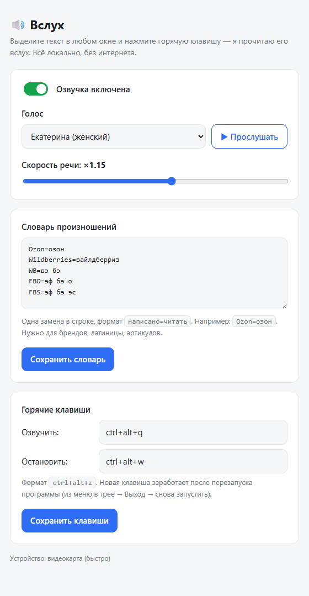

<div align="center">


# Вслух

### Выделил текст — услышал.

Локальная озвучка выделенного текста живым русским голосом.
**Работает офлайн. Бесплатно. Ничего не уходит в интернет.**


</div>

---

## 🎧 Что это

Выделяете любой текст в любом окне — статью, письмо, чат, PDF, — жмёте
**Ctrl + Alt + Z**, и слышите его живым голосом. Можно оторвать глаза от экрана:
слушать длинные тексты, вычитывать свои посты на слух, разбирать переписки,
пока руки заняты другим.

Голос синтезируется **прямо на вашем компьютере**. Интернет не нужен вообще —
ни одна буква никуда не отправляется.

<div align="center">

</div>

## ✨ Возможности

- 🔊 **6 русских голосов** на выбор — мужские и женские, с кнопкой «прослушать».
- 💻 **Полностью офлайн и приватно.** Ни одна буква не уходит в сеть.
- ⚡ **Быстро.** Начинает читать через ~секунду. Есть видеокарта NVIDIA — использует её; нет — работает на процессоре.
- 🎚 **Гибкая настройка:** скорость речи, свой **словарь произношений** (чтобы бренды, латиница и артикулы читались правильно: `Ozon → озон`, `FBO → эф бэ о`).
- ⌨️ **Глобальная горячая клавиша** — работает в любой программе.
- 🆓 **Чистая лицензия (MIT)** — и код, и голоса. Пользуйтесь как угодно.

## 🗣 Голоса

Мужские: **Александр**, **Дмитрий**, **Эдуард**.
Женские: **Екатерина**, **Вика**, **Оксана**.

Голоса синтетические (модель Silero v5), не привязаны к реальным людям.

---

## 📦 Установка

> **Требуется [Python 3.10–3.12](https://www.python.org/downloads/)** (при установке
> поставьте галочку **«Add Python to PATH»**). Папку с программой держите в пути
> **без русских букв** — например `C:\vsluh` (иначе не работает движок озвучки).

### Способ 1. Вручную — двойным кликом

Для любого человека, без программирования:

1. Нажмите зелёную кнопку **`Code ▾` → `Download ZIP`** вверху этой страницы и распакуйте архив (например в `C:\vsluh`).
2. Двойной клик по **`install.bat`**.
   Он сам поставит всё нужное, скачает голос (~90 МБ) и пропишет автозапуск. Первый раз — несколько минут.
3. Готово! Возле часов появится иконка 🔊. Выделите текст и нажмите **Ctrl + Alt + Z**.

### Способ 2. Через Claude Code

Если у вас установлен [Claude Code](https://claude.ai/code), просто дайте ему такую команду:

```
Склонируй https://github.com/Kabankok/vsluh в C:\vsluh и установи «Вслух»
по инструкции из README (запусти install.bat). Проверь, что стоит Python 3.10–3.12,
если нет — подскажи, как поставить.
```

Claude Code сам склонирует репозиторий, проверит окружение и прогонит установку.

---

## 🚀 Как пользоваться

| Действие | Клавиши |
|---|---|
| 🔊 Озвучить выделенное | **Ctrl + Alt + Z** |
| ⏹ Остановить | **Ctrl + Alt + X** |

- **Настройки** — правый клик по иконке 🔊 в трее → «Настройки…» (или ярлык
  **«Вслух — настройки»** на рабочем столе). Там выбор голоса с превью, скорость,
  словарь произношений и свои горячие клавиши.
- **Сменить голос / выключить озвучку** — прямо из меню в трее.
- **Выход** — из меню в трее.

## 🧳 Портативность

Вся программа лежит в одной папке (голос и настройки — рядом). Чтобы перенести на
другой компьютер, скопируйте папку и запустите `install.bat` там ещё раз — он
до-настроит окружение под новую машину.

## ⚙️ Как это устроено

Два процесса: **движок** (модель Silero + расстановка ударений RUAccent + горячие
клавиши + локальный сервер настроек) и лёгкий **трей** (иконка, общается с движком
по `127.0.0.1`). Так библиотека нейросети и оконный интерфейс не конфликтуют.
Горячая клавиша — низкоуровневый хук клавиатуры (работает при любой раскладке),
захват выделения — нативный `Ctrl+C` через WinAPI, без сторонних хук-библиотек.

## 📄 Лицензии

Код — **MIT**. Голосовая модель Silero v5 CIS base — **MIT**, расстановка ударений
RUAccent — **Apache-2.0**. Все компоненты разрешают коммерческое использование.
Подробности и атрибуция — в [NOTICE.md](NOTICE.md).

<div align="center">
<sub>Сделано с ❤️ для тех, кто много читает с экрана.</sub>
</div>
